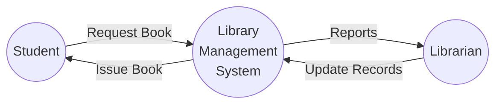
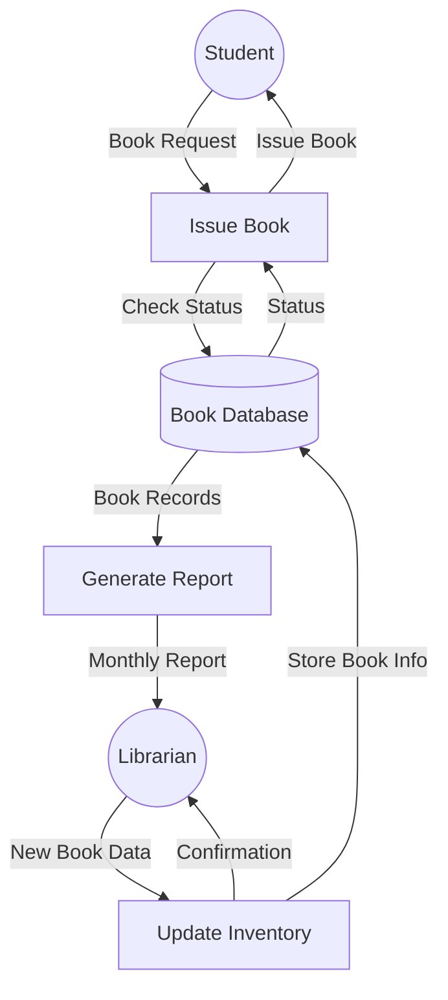
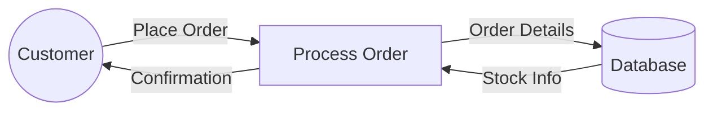
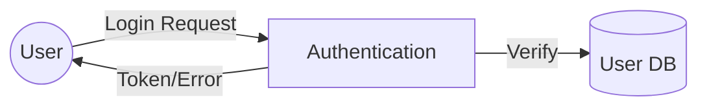

# Data Flow Diagram (DFD) in Software Engineering

A Data Flow Diagram (DFD) is a graphical representation of how data flows through an information system. It shows the processes, data stores, external entities, and the data flows connecting them.

## Basic DFD Components

1. **Process** (Circle/Bubble): Represents data transformation
2. **Data Flow** (Arrow): Shows data movement
3. **Data Store** (Rectangle): Where data is stored
4. **External Entity** (Rectangle): Source or destination of data

## Example: Library Management System

### Context Level (Level 0) DFD

### Level 1 DFD

## Common Use Cases

1. **Order Processing System**

2. **User Authentication**

## Best Practices

1. Number all processes
2. Use meaningful names
3. Maintain consistency in notation
4. Show data flows explicitly
5. Avoid crossing lines where possible

## Common Mistakes to Avoid

1. Missing data flows
2. Incorrect process names
3. Inconsistent notation
4. Too much detail in high-level diagrams
5. Direct flows between data stores

DFDs help visualize system requirements and data transformations, making them invaluable in software engineering for both analysis and design phases.
