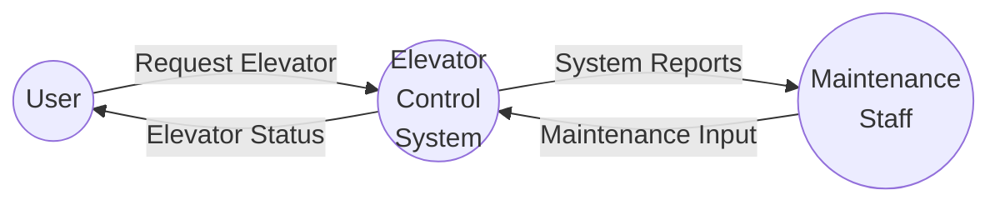
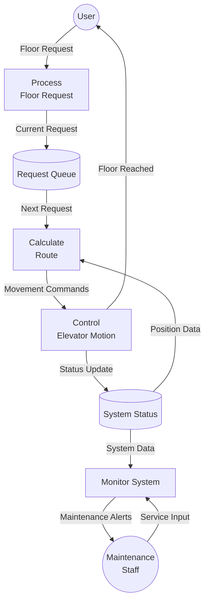
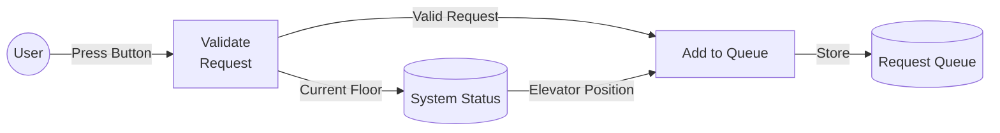

# Elevator System - Data Flow Diagrams

## Context Level (Level 0) DFD

This diagram shows the highest-level view of the elevator system.



## Level 1 DFD

Detailed breakdown of the elevator control system.



## Level 2 DFD: Floor Request Processing

Detailed view of the floor request handling process.



## Main Processes Description

1. **Floor Request Processing (P1)**
   - Handles user input from buttons
   - Validates request feasibility
   - Manages request queue

2. **Route Calculation (P2)**
   - Determines optimal path
   - Considers current position
   - Implements elevator algorithm

3. **Motion Control (P3)**
   - Controls motor operations
   - Manages door operations
   - Ensures safety protocols

4. **System Monitoring (P4)**
   - Tracks maintenance needs
   - Monitors safety parameters
   - Generates system reports

## Data Stores

1. **Request Queue (DS1)**
   - Pending floor requests
   - Request priorities
   - Timestamp data

2. **System Status (DS2)**
   - Current position
   - Operating status
   - Maintenance logs

## Key Data Flows

1. **User Interactions**
   ```mermaid
   graph LR
       A[Floor Button] -->|Request| B[System]
       B -->|Status| C[Display]
   ```

2. **Safety Controls**
   ```mermaid
   graph LR
       A[Sensors] -->|Safety Data| B[Control System]
       B -->|Emergency Stop| C[Motor Control]
   ```

## Implementation Considerations

1. **Real-time Processing**
   - Quick response to requests
   - Immediate safety checks
   - Status updates

2. **Safety Priorities**
   - Emergency protocols
   - Overload detection
   - Door safety mechanisms

3. **Optimization**
   - Energy efficiency
   - Minimal wait times
   - Smart floor sequencing

This DFD model helps visualize the complex interactions in an elevator system, making it easier to understand and implement the control logic.
